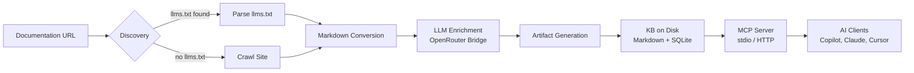

<div align="center">

# ContextBuilder

**Turn any documentation site into AI-ready artifacts and a portable knowledge base.**

[](https://rustup.rs/)
[](https://bun.sh/)
[](https://modelcontextprotocol.io/)
[](LICENSE)

[Quick Start](#quick-start) · [User Guide](docs/user-guide.md) · [MCP Integration](docs/mcp-integration-guide.md) · [Configuration](docs/configuration-reference.md) · [API Reference](docs/api-reference.md) · [Contributing](docs/developer-guide.md)

</div>

---

ContextBuilder is a **local-first documentation ingestion tool** that converts a docs URL into structured AI artifacts and a portable knowledge base. Point it at any documentation site, and it will:

1. **Discover** content via [`llms.txt`](https://llmstxt.org/) or intelligent crawling
2. **Convert** HTML pages to clean Markdown with platform-aware extraction
3. **Enrich** content with LLM-generated structured artifacts
4. **Store** everything in a portable KB (Markdown files + SQLite indexes)
5. **Serve** the KB to AI clients via the [Model Context Protocol](https://modelcontextprotocol.io/)

```
URL → Discovery → Crawl → Markdown → LLM Enrichment → Artifacts → KB on disk → MCP Server → AI Clients
```

## Why ContextBuilder?

Modern AI coding assistants are powerful—but they don't know your team's libraries, internal tools, or niche frameworks. ContextBuilder bridges that gap:

- **Feed any docs to any AI** — Turn documentation sites into knowledge that Claude, Copilot, Cursor, or any MCP-compatible client can query
- **Always fresh** — Incremental updates detect content changes via SHA-256 hashing; only re-process what changed
- **Privacy-first** — Your KB lives on your machine. No cloud sync, no third-party storage
- **Framework-aware** — Built-in adapters for Docusaurus, VitePress, GitBook, ReadTheDocs, and generic sites extract content intelligently

## Features

| Feature | Description |
|---------|-------------|
| **Smart Discovery** | Detects `llms.txt` for instant ingestion; falls back to intelligent crawling with depth/page limits |
| **Platform Adapters** | Built-in extractors for Docusaurus, VitePress, GitBook, ReadTheDocs + generic fallback |
| **LLM Enrichment** | Always-on AI enrichment generates 6 structured artifacts from crawled content |
| **MCP Server** | Serve any KB via Model Context Protocol (stdio + Streamable HTTP transports) |
| **Interactive TUI** | Browse KBs, view pages, search content, and manage everything from a terminal UI |
| **Incremental Updates** | Content-hash change detection — only re-crawl and re-enrich what changed |
| **Full-Text Search** | SQLite FTS5 indexes for instant full-text search across all pages |
| **Enrichment Cache** | LLM results are cached by content hash + model — unchanged pages skip LLM calls |
| **Cross-Language** | Rust CLI writes, TypeScript MCP server reads — shared schemas ensure consistency |

### Generated Artifacts

Every KB produces 6 AI-optimized artifacts:

| Artifact | Purpose |
|----------|---------|
| `llms.txt` | Compact overview following the [llms.txt spec](https://llmstxt.org/) |
| `llms-full.txt` | Complete documentation in a single file for large-context models |
| `SKILL.md` | Structured skill definition following the [Agent Skills spec](https://agentskills.io/) |
| `rules.md` | Coding rules and conventions extracted from the documentation |
| `style.md` | Code style patterns and formatting preferences |
| `do_dont.md` | Explicit do/don't guidelines for AI assistants |

---

## Quick Start

### Prerequisites

- [Rust](https://rustup.rs/) 1.85+ (Edition 2024)
- [Bun](https://bun.sh/) 1.3+
- An [OpenRouter API key](https://openrouter.ai/) (for LLM enrichment)

### Install & Build

```bash
# Clone and build
git clone https://github.com/PerkyZZ999/ContextBuilder.git
cd ContextBuilder
make build

# Set your API key
export OPENROUTER_API_KEY=sk-or-v1-...
```

### Create Your First Knowledge Base

```bash
# Ingest documentation from a URL
./target/debug/contextbuilder add https://docs.example.com --name "Example Docs"

# Output:
#   Knowledge base created successfully!
#   ID:     019748d2-...
#   Pages:  42
#   Path:   var/kb/019748d2-...
```

### Connect to Your AI Client

```bash
# Get config snippet for VS Code / Copilot
./target/debug/contextbuilder mcp config --target vscode --kb var/kb/<kb-id>

# Or start the MCP server directly
./target/debug/contextbuilder mcp serve --kb var/kb/<kb-id>
```

### Keep It Updated

```bash
# Incremental update — only processes changed pages
./target/debug/contextbuilder update --kb var/kb/<kb-id>
```

> **See the [User Guide](docs/user-guide.md) for a comprehensive walkthrough** covering installation, KB management, the TUI, configuration, and advanced usage.

---

## MCP Integration

ContextBuilder speaks the [Model Context Protocol](https://modelcontextprotocol.io/) (revision 2025-11-25), exposing your knowledge bases through **5 tools** and **3 resource templates**.

### Tools

| Tool | Description | Key Parameters |
|------|-------------|----------------|
| `kb_list` | List all loaded knowledge bases | — |
| `kb_get_toc` | Get table of contents for a KB | `kb_id` |
| `kb_get_page` | Read a page's content and metadata | `kb_id`, `path` |
| `kb_search` | Full-text search across pages | `kb_id`, `query`, `limit?` |
| `kb_get_artifact` | Read a generated artifact | `kb_id`, `artifact_name` |

### Resources

| URI Template | MIME Type |
|-------------|-----------|
| `contextbuilder://kb/{id}/docs/{+path}` | `text/markdown` |
| `contextbuilder://kb/{id}/artifacts/{name}` | `text/markdown` |
| `contextbuilder://kb/{id}/toc` | `application/json` |

### Client Setup

<details>
<summary><strong>VS Code (GitHub Copilot)</strong></summary>

Add to `.vscode/mcp.json`:
```json
{
  "servers": {
    "contextbuilder": {
      "type": "stdio",
      "command": "bun",
      "args": ["run", "/path/to/contextbuilder/apps/mcp-server/src/index.ts", "--kb", "/path/to/kb"]
    }
  }
}
```
</details>

<details>
<summary><strong>Claude Desktop</strong></summary>

Add to `claude_desktop_config.json`:
```json
{
  "mcpServers": {
    "contextbuilder": {
      "command": "bun",
      "args": ["run", "/path/to/contextbuilder/apps/mcp-server/src/index.ts", "--kb", "/path/to/kb"]
    }
  }
}
```
</details>

<details>
<summary><strong>Cursor</strong></summary>

Add to Cursor MCP settings:
```json
{
  "mcpServers": {
    "contextbuilder": {
      "command": "bun",
      "args": ["run", "/path/to/contextbuilder/apps/mcp-server/src/index.ts", "--kb", "/path/to/kb"]
    }
  }
}
```
</details>

> **See the [MCP Integration Guide](docs/mcp-integration-guide.md) for detailed configuration**, transport options, troubleshooting, and advanced usage patterns.

---

## Architecture



### Monorepo Layout

| Path | Lang | Role |
|------|------|------|
| `apps/cli/` | Rust | CLI binary — `contextbuilder` |
| `apps/tui/` | Rust | TUI binary — `contextbuilder-tui` |
| `apps/llm-enrich/` | Rust | LLM enrichment subprocess orchestration |
| `apps/mcp-server/` | TypeScript | MCP server (stdio + Streamable HTTP) |
| `packages/rust/core/` | Rust | Pipeline orchestration |
| `packages/rust/discovery/` | Rust | `llms.txt` detection and parsing |
| `packages/rust/crawler/` | Rust | Concurrent web crawler |
| `packages/rust/markdown/` | Rust | HTML → Markdown with platform adapters |
| `packages/rust/artifacts/` | Rust | Artifact generators (6 artifact types) |
| `packages/rust/storage/` | Rust | SQLite/libSQL storage layer |
| `packages/rust/shared/` | Rust | Shared types, config, errors |
| `packages/ts/kb-reader/` | TypeScript | Read-only KB access library |
| `packages/ts/openrouter-provider/` | TypeScript | LLM bridge (OpenRouter via Vercel AI SDK) |
| `packages/ts/shared/` | TypeScript | Shared TS types and constants |
| `packages/schemas/` | JSON Schema | Cross-language schemas (manifest, TOC, artifacts, MCP) |

### Key Design Principles

- **Rust writes, TypeScript reads** — The CLI is the sole writer to the filesystem and database. The MCP server is strictly read-only.
- **LLM enrichment is always-on** — Every `add`/`update` invokes the OpenRouter bridge subprocess. There is no `--llm off` flag.
- **No IPC** — Rust and TypeScript share state via the filesystem + SQLite database. The enrichment bridge uses stdin/stdout JSON-lines.
- **Content-addressed caching** — Enrichment results are cached by `(kb_id, artifact_type, content_hash, model_id)`. Unchanged pages get instant cache hits.

> **See the [Architecture Guide](docs/architecture.md) for a deep dive** into the data flow, DB schema, adapter system, and cross-language integration.

---

## Configuration

Configuration lives in `~/.contextbuilder/contextbuilder.toml`:

```toml
[openrouter]
api_key_env = "OPENROUTER_API_KEY"    # env var name (not the key itself)
default_model = "moonshotai/kimi-k2.5"

[defaults]
max_pages = 500
max_depth = 5
request_delay_ms = 200
concurrent_requests = 5
respect_robots_txt = true
user_agent = "ContextBuilder/0.1"

[crawl_policies]
# Per-domain overrides
# [crawl_policies."docs.example.com"]
# max_pages = 1000
```

```bash
# Initialize config with defaults
contextbuilder config init

# Show current configuration
contextbuilder config show
```

**Precedence:** CLI flags > config file > built-in defaults.

> **See the [Configuration Reference](docs/configuration-reference.md) for all fields, defaults, and environment variables.**

---

## Development

```bash
make build    # cargo build --workspace && bun run build
make test     # cargo test --workspace && bun test
make lint     # cargo clippy -D warnings && bunx biome check .
make fmt      # cargo fmt --all && bunx biome format --write .
make check    # lint + test in one command
make clean    # Remove build artifacts
```

### Test Suite

| Suite | Tests | Framework |
|-------|-------|-----------|
| Rust unit + integration | 146 | `cargo test` |
| TypeScript KB reader | 19 | `bun test` |
| MCP server integration | 15 | `bun test` |
| E2E MCP pipeline | 29 | `bun test` |
| OpenRouter provider | 18 | `bun test` |
| Shared schemas | 24 | `bun test` |
| **Total** | **251** | |

> **See the [Developer Guide](docs/developer-guide.md) for contributing guidelines**, building from source, test conventions, and code architecture.

---

## Documentation

| Document | Description |
|----------|-------------|
| [User Guide](docs/user-guide.md) | End-to-end usage walkthrough |
| [MCP Integration Guide](docs/mcp-integration-guide.md) | Connecting to AI clients |
| [Configuration Reference](docs/configuration-reference.md) | All config fields and defaults |
| [Architecture Guide](docs/architecture.md) | System design and data flow |
| [API Reference](docs/api-reference.md) | CLI, MCP, and library APIs |
| [Developer Guide](docs/developer-guide.md) | Contributing and development |
| [Technical Specification](docs/technical-specification.md) | Full technical spec |
| [Changelog](CHANGELOG.md) | Release history |

---

## Contributing

1. Fork the repository
2. Create a feature branch (`git checkout -b feature/my-feature`)
3. Make your changes and add tests
4. Run `make check` (lint + test)
5. Submit a pull request

See the [Developer Guide](docs/developer-guide.md) for detailed contributing guidelines.

---

## License

[MIT](LICENSE)
