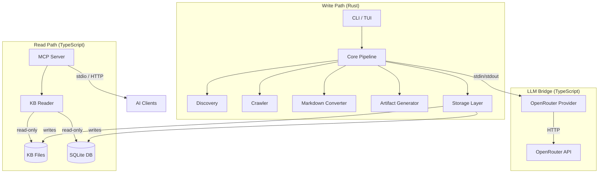
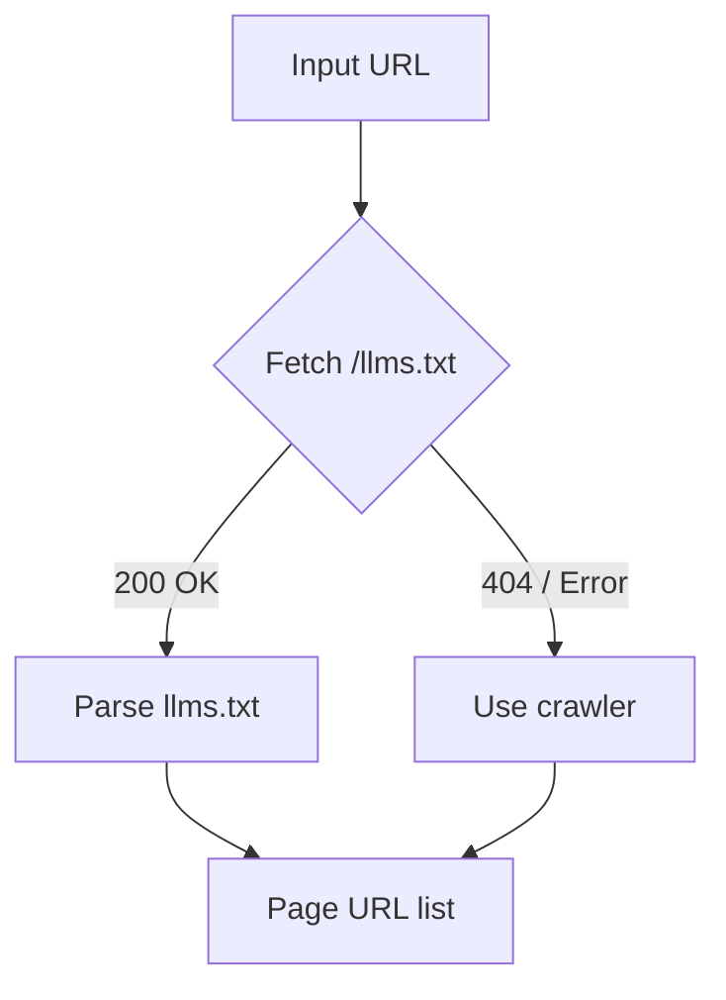
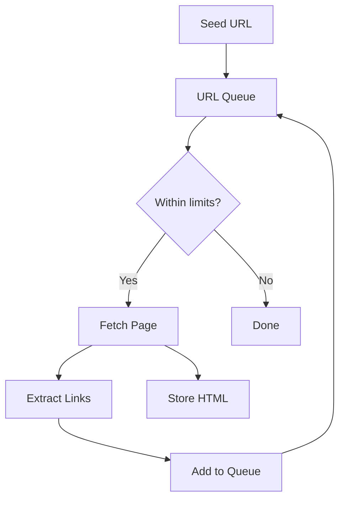
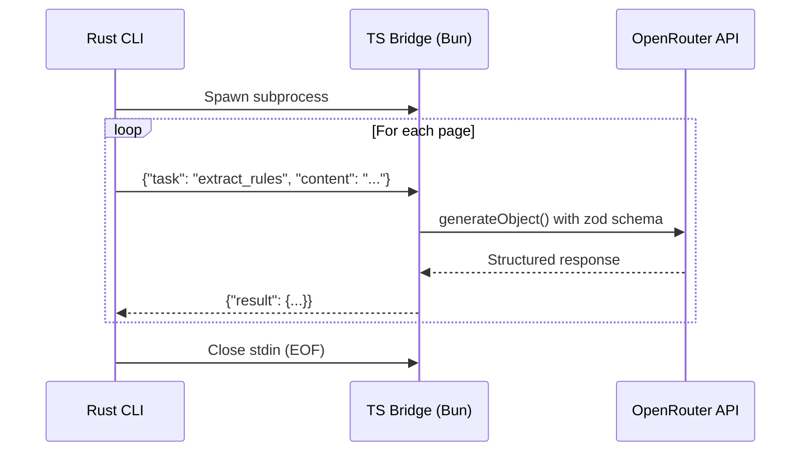
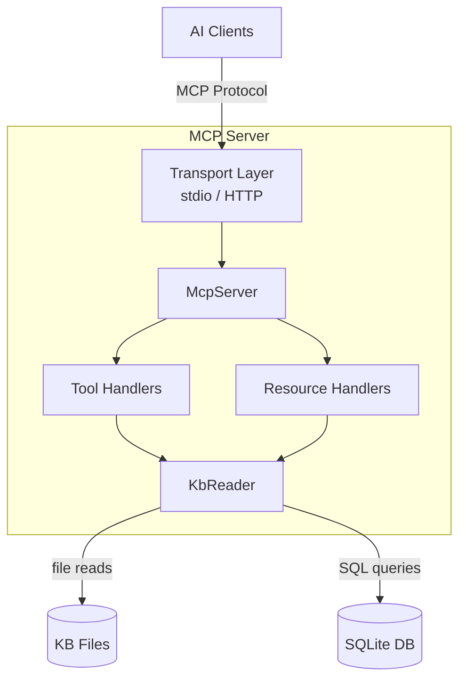
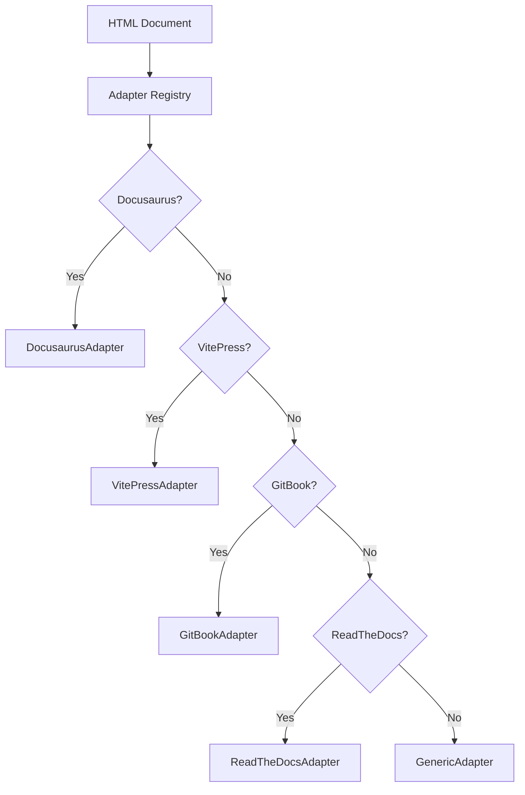
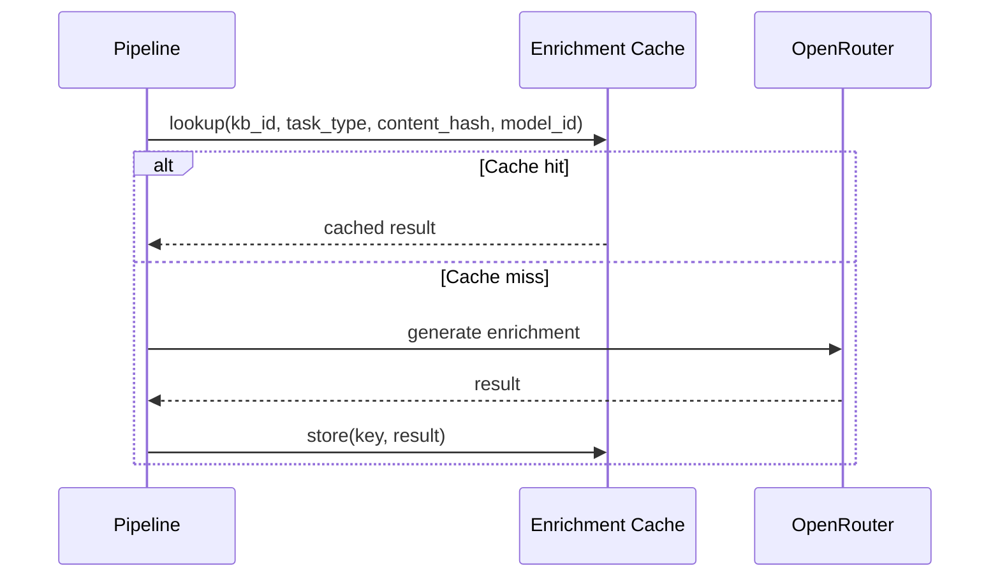
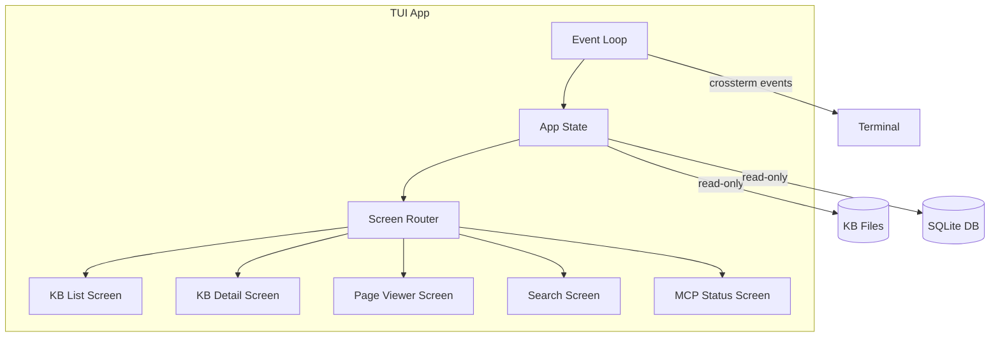

# Architecture Guide

A deep dive into ContextBuilder's system design — data flow, component interactions, database schema, cross-language integration, and key architectural decisions.

---

## Table of Contents

- [System Overview](#system-overview)
- [Pipeline Architecture](#pipeline-architecture)
  - [Step 1: Discovery](#step-1-discovery)
  - [Step 2: Crawling](#step-2-crawling)
  - [Step 3: Markdown Conversion](#step-3-markdown-conversion)
  - [Step 4: LLM Enrichment](#step-4-llm-enrichment)
  - [Step 5: Artifact Generation](#step-5-artifact-generation)
  - [Step 6: Storage](#step-6-storage)
- [Cross-Language Architecture](#cross-language-architecture)
- [Database Schema](#database-schema)
- [Knowledge Base Layout](#knowledge-base-layout)
- [MCP Server Architecture](#mcp-server-architecture)
- [Platform Adapter System](#platform-adapter-system)
- [Enrichment Cache](#enrichment-cache)
- [TUI Architecture](#tui-architecture)
- [Design Decisions](#design-decisions)

---

## System Overview

ContextBuilder is a **Rust + TypeScript monorepo** with a clear separation of concerns:

- **Rust** handles all write-path operations: CLI, crawling, conversion, artifact generation, and database writes
- **TypeScript** handles all read-path and LLM operations: MCP server (read-only), KB reader, and OpenRouter LLM bridge



### Key Invariants

1. **Rust is the sole writer** — Only Rust code writes to the filesystem or database
2. **TypeScript is read-only** — The MCP server and KB reader never write to the KB
3. **LLM enrichment is always-on** — Every `add`/`update` invokes the LLM bridge. There is no opt-out
4. **No IPC between Rust and TS** — They share state via filesystem + SQLite database
5. **The enrichment bridge is one-shot** — Spawned as a subprocess per operation, not a persistent server

---

## Pipeline Architecture

The core pipeline processes a URL through 6 sequential steps:


### Step 1: Discovery

**Crate:** `packages/rust/discovery/`

The discovery step determines what content exists at the target URL:

1. **Check for `llms.txt`** — Fetch `{base_url}/llms.txt`. If found, parse it per the [llms.txt specification](https://llmstxt.org/) to get a list of page URLs.
2. **Fallback to crawling** — If no `llms.txt` is found, pass the URL to the crawler.



**Key types:**
- `DiscoveryResult` — Contains the list of page URLs and the discovery method used
- `LlmsTxtParser` — Parses the `llms.txt` format

### Step 2: Crawling

**Crate:** `packages/rust/crawler/`

When discovery falls back to crawling, the crawler fetches pages concurrently:

- **Concurrency control:** `tokio::Semaphore` limits parallel requests (default: 5)
- **Rate limiting:** Configurable delay between requests (default: 200ms)
- **robots.txt:** Respected by default (configurable)
- **Scope limiting:** Stays within the same domain; respects max depth and page count
- **Deduplication:** URL normalization prevents revisiting the same page



**Key types:**
- `CrawlJob` — Represents a crawl operation with its configuration
- `CrawlResult` — Contains fetched pages with HTML content and metadata

### Step 3: Markdown Conversion

**Crate:** `packages/rust/markdown/`

HTML pages are converted to clean Markdown using platform-specific adapters:

1. **Adapter detection** — Try each registered adapter in priority order
2. **Content extraction** — The matching adapter extracts the main content, stripping navigation, headers, footers
3. **HTML → Markdown** — Convert the extracted HTML to Markdown

See [Platform Adapter System](#platform-adapter-system) for details on the adapter architecture.

### Step 4: LLM Enrichment

**Package:** `packages/ts/openrouter-provider/`

The enrichment step calls an LLM to generate structured data from the documentation:

1. **Rust spawns the TS bridge** as a subprocess
2. **JSON-lines protocol** — Rust sends enrichment tasks via stdin, receives results via stdout
3. **8 task types** — Each task generates a different type of structured output
4. **Cache check** — Before sending a task, check the enrichment cache; skip if cached



**Task types:**

| Task | Output | Used In |
|------|--------|---------|
| `extract_rules` | Coding rules and conventions | `rules.md` |
| `extract_style` | Style patterns and preferences | `style.md` |
| `extract_do_dont` | Do/don't pairs | `do_dont.md` |
| `extract_skill` | Skill definition | `SKILL.md` |
| `extract_summary` | Page summary | `llms.txt` |
| `extract_full_content` | Clean full content | `llms-full.txt` |
| `extract_metadata` | Structured metadata | Internal |
| `extract_toc_entry` | TOC metadata | Internal |

### Step 5: Artifact Generation

**Crate:** `packages/rust/artifacts/`

Enrichment results are assembled into 6 final artifacts:

| Artifact | Input | Strategy |
|----------|-------|----------|
| `llms.txt` | Page summaries | Concatenate with section headers per llms.txt spec |
| `llms-full.txt` | Full page content | Concatenate all pages into one document |
| `SKILL.md` | Skill extractions | Merge and deduplicate into Agent Skills format |
| `rules.md` | Rule extractions | Merge, deduplicate, and organize by category |
| `style.md` | Style extractions | Merge into cohesive style guide |
| `do_dont.md` | Do/don't pairs | Deduplicate and format as table |

### Step 6: Storage

**Crate:** `packages/rust/storage/`

The final step persists everything to disk:

1. **Write Markdown files** to `docs/` directory (preserving URL hierarchy)
2. **Write artifacts** to `artifacts/` directory
3. **Write metadata** — `manifest.json` and `toc.json`
4. **Update database** — Insert/update pages, TOC entries, FTS5 index, enrichment cache

---

## Cross-Language Architecture

Rust and TypeScript share no runtime. They communicate through two mechanisms:

### 1. Filesystem + Database (MCP Server)

```
Rust CLI ──writes──→ KB Directory ←──reads── TypeScript MCP Server
                      (files + DB)
```

The KB directory and its SQLite database serve as the shared state. Rust writes during `add`/`update`/`build`. TypeScript reads during MCP tool/resource requests.

### 2. stdin/stdout JSON-Lines (Enrichment Bridge)

```
Rust CLI ──spawns──→ TypeScript subprocess
           stdin ──→ JSON-lines tasks
           stdout ←─ JSON-lines results
```

The enrichment bridge is a **one-shot subprocess** (not a persistent server). Rust spawns it, sends tasks, reads results, and the process exits.

### Shared Schemas

Cross-language consistency is enforced by schemas in `packages/schemas/`:

```
packages/schemas/
├── manifest/    → manifest.json structure
├── toc/         → toc.json structure
├── artifacts/   → Artifact metadata
└── mcp/         → MCP message formats
```

Each schema has:
- A JSON Schema file (for Rust validation via `serde` + `jsonschema`)
- A zod schema (for TypeScript validation)

---

## Database Schema

The SQLite database (`indexes/contextbuilder.db`) contains 7 tables:

```sql
-- Core page storage
CREATE TABLE pages (
    id TEXT PRIMARY KEY,           -- UUID v7
    kb_id TEXT NOT NULL,           -- FK to knowledge base
    path TEXT NOT NULL,            -- Relative path within KB
    title TEXT,
    url TEXT,                      -- Source URL
    content TEXT NOT NULL,         -- Markdown content
    content_hash TEXT NOT NULL,    -- SHA-256 for change detection
    created_at TEXT NOT NULL,      -- ISO 8601
    updated_at TEXT NOT NULL
);

-- Full-text search index
CREATE VIRTUAL TABLE pages_fts USING fts5(
    title,
    content,
    content='pages',
    content_rowid='rowid'
);

-- Table of contents hierarchy
CREATE TABLE toc_entries (
    id TEXT PRIMARY KEY,
    kb_id TEXT NOT NULL,
    title TEXT NOT NULL,
    path TEXT NOT NULL,
    parent_id TEXT,               -- Self-referential FK
    sort_order INTEGER NOT NULL,
    depth INTEGER NOT NULL
);

-- LLM enrichment cache
CREATE TABLE enrichment_cache (
    id TEXT PRIMARY KEY,
    kb_id TEXT NOT NULL,
    artifact_type TEXT NOT NULL,
    content_hash TEXT NOT NULL,   -- SHA-256 of source content
    model_id TEXT NOT NULL,       -- LLM model used
    result TEXT NOT NULL,         -- Cached LLM output (JSON)
    created_at TEXT NOT NULL
);

-- KB metadata
CREATE TABLE knowledge_bases (
    id TEXT PRIMARY KEY,          -- UUID v7
    name TEXT NOT NULL,
    source_url TEXT NOT NULL,
    schema_version INTEGER NOT NULL DEFAULT 1,
    created_at TEXT NOT NULL,
    updated_at TEXT NOT NULL
);

-- Crawl history
CREATE TABLE crawl_jobs (
    id TEXT PRIMARY KEY,          -- UUID v7
    kb_id TEXT NOT NULL,
    status TEXT NOT NULL,         -- pending, running, completed, failed
    pages_crawled INTEGER DEFAULT 0,
    pages_total INTEGER DEFAULT 0,
    started_at TEXT,
    completed_at TEXT,
    error TEXT
);

-- Artifact metadata
CREATE TABLE artifacts (
    id TEXT PRIMARY KEY,
    kb_id TEXT NOT NULL,
    name TEXT NOT NULL,           -- e.g., "llms.txt", "rules.md"
    content_hash TEXT NOT NULL,
    created_at TEXT NOT NULL,
    updated_at TEXT NOT NULL
);
```

### FTS5 Integration

The `pages_fts` table is kept in sync with `pages` via triggers. The MCP server's `kb_search` tool queries this FTS5 index for full-text search.

### Enrichment Cache Key

Cache lookups use a composite key: `(kb_id, artifact_type, content_hash, model_id)`. This means:

- Same content + same model → cache hit (fast)
- Changed content → cache miss → new LLM call
- Different model → cache miss → new LLM call

---

## Knowledge Base Layout

Each KB is a self-contained directory:

```
var/kb/<uuid>/
├── manifest.json              # KB metadata
│   {
│     "schema_version": 1,
│     "id": "019748d2-...",
│     "name": "Example Docs",
│     "source_url": "https://...",
│     "created_at": "...",
│     "updated_at": "..."
│   }
│
├── toc.json                   # Hierarchical table of contents
│   {
│     "entries": [
│       { "title": "...", "path": "...", "children": [...] }
│     ]
│   }
│
├── docs/                      # Converted Markdown pages
│   ├── getting-started.md
│   ├── api/
│   │   ├── overview.md
│   │   └── endpoints.md
│   └── ...
│
├── artifacts/                 # Generated AI artifacts
│   ├── llms.txt
│   ├── llms-full.txt
│   ├── SKILL.md
│   ├── rules.md
│   ├── style.md
│   └── do_dont.md
│
└── indexes/
    └── contextbuilder.db      # SQLite database
```

This layout is **portable** — you can copy/move a KB directory and it remains fully functional.

---

## MCP Server Architecture

The MCP server is a TypeScript application using `@modelcontextprotocol/sdk`:



### Startup Flow

1. Parse CLI args (`--kb`, `--transport`, `--port`)
2. Initialize `KbReader` with the KB path
3. Register 5 tools and 3 resource templates
4. Start the transport (stdio or HTTP)
5. Enter the MCP request loop

### KbReader

The `KbReader` class (`packages/ts/kb-reader/`) provides the read-only data access layer:

| Method | Returns |
|--------|---------|
| `static open(kbPath)` | New KbReader instance |
| `static discoverKbs(dir)` | Array of KB paths in a directory |
| `getManifest()` | KB metadata |
| `getToc()` | Table of contents |
| `getPage(path)` | Page content + metadata |
| `searchPages(query, limit?)` | FTS5 search results |
| `getArtifact(name)` | Artifact content |
| `listArtifacts()` | Available artifact names |
| `getSummary()` | KB summary stats |
| `getPageCount()` | Total page count |
| `getRecentPages(limit?)` | Recently updated pages |
| `close()` | Close DB connection |

---

## Platform Adapter System

The adapter system uses a trait-based registry pattern:



### The `PlatformAdapter` Trait

```rust
pub trait PlatformAdapter: Send + Sync {
    /// Detect if this adapter handles the given document
    fn detect(doc: &Html, url: &Url) -> Option<Self> where Self: Sized;

    /// Extract table of contents / navigation
    fn extract_toc(&self, doc: &Html) -> Vec<TocEntry>;

    /// Extract the main content as HTML
    fn extract_content(&self, doc: &Html) -> String;

    /// Extract page metadata
    fn extract_metadata(&self, doc: &Html) -> PageMeta;

    /// Adapter name for logging
    fn name(&self) -> &str;
}
```

### Built-in Adapters

| Adapter | Detection Strategy | Content Selector |
|---------|-------------------|-----------------|
| `DocusaurusAdapter` | `<meta name="generator" content="Docusaurus">` | `<article>` |
| `VitePressAdapter` | `.vp-doc` class | `.vp-doc` container |
| `GitBookAdapter` | GitBook-specific elements | GitBook page structure |
| `ReadTheDocsAdapter` | Sphinx/RTD class names | `.rst-content` |
| `GenericAdapter` | Always matches (fallback) | `<main>` / `<article>` / `<body>` |

Adapters are tried in priority order. The first adapter whose `detect()` returns `Some` wins.

---

## Enrichment Cache

The enrichment cache prevents redundant LLM calls during incremental updates:



### Cache Key Components

| Component | Purpose |
|-----------|---------|
| `kb_id` | Scopes cache to a specific KB |
| `artifact_type` | The enrichment task type |
| `content_hash` | SHA-256 of the source content — changes invalidate |
| `model_id` | The LLM model used — different models produce different results |

### Cache Behavior

- **First `add`:** All cache misses → full LLM enrichment
- **Incremental `update`:** Only changed pages (different hash) trigger LLM calls
- **Model change:** All pages re-enriched (model is part of the key)
- **`build` with same content:** Full cache hits → instant artifact regeneration

---

## TUI Architecture

The TUI uses `ratatui` + `crossterm` for a terminal-based interface:



### App Struct

The central `App` struct manages:
- Current screen state
- Navigation history (back stack)
- Loaded KB data
- Search state
- MCP server process control

### Rendering Flow

1. `crossterm` polls for keyboard/mouse events
2. Events are dispatched to the current screen's handler
3. Screen handler updates `App` state
4. `ratatui` renders the current screen into a terminal frame
5. Loop continues at ~60fps

---

## Design Decisions

### Why Rust + TypeScript?

**Rust** excels at:
- High-performance concurrent crawling
- Efficient HTML parsing and Markdown conversion
- Reliable file I/O and database operations
- Type-safe pipeline orchestration

**TypeScript** excels at:
- MCP SDK integration (official SDK is TypeScript)
- LLM API integration (Vercel AI SDK)
- Rapid iteration on protocol-level code

### Why No IPC?

Using the filesystem + SQLite as the shared state layer eliminates:
- Complex serialization protocols
- Process lifecycle management
- Connection state management
- Failure mode coupling

The trade-off is eventual consistency (the MCP server sees a snapshot), which is acceptable since KBs change infrequently.

### Why Always-On Enrichment?

LLM enrichment is the core differentiator. Without it, ContextBuilder would just be a crawler + Markdown converter. The enrichment cache makes it cheap after the first run, so there's no benefit to an opt-out flag.

### Why UUID v7?

UUID v7 is **time-sortable** — KBs and pages sort chronologically by their ID. This makes `list` output naturally ordered and enables efficient range queries.

### Why SQLite (libSQL)?

- **Portable** — The database is a single file that moves with the KB
- **FTS5** — Built-in full-text search without additional dependencies
- **Read concurrency** — Multiple MCP server instances can read simultaneously
- **libSQL compatibility** — Future path to Turso cloud sync if needed

---

## Next Steps

- [API Reference](api-reference.md) — Full API documentation
- [Developer Guide](developer-guide.md) — Contributing guidelines
- [Configuration Reference](configuration-reference.md) — All settings
- [Technical Specification](technical-specification.md) — Detailed specs
