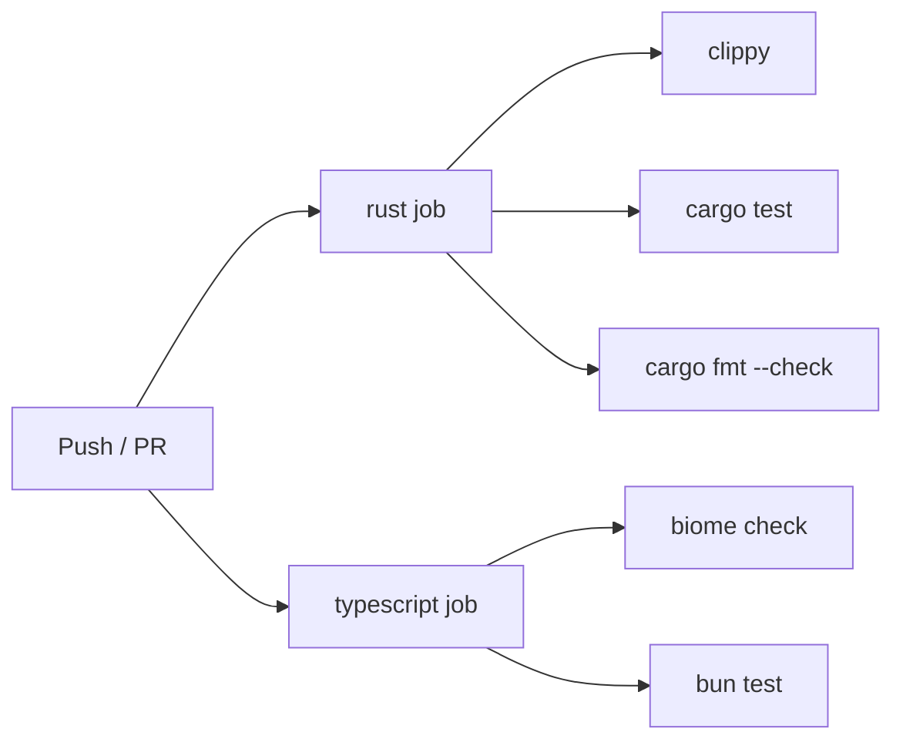

# Developer Guide

This guide covers everything you need to contribute to ContextBuilder — building from source, running tests, understanding the codebase, and adding new features.

---

## Table of Contents

- [Getting Started](#getting-started)
- [Build System](#build-system)
- [Running Tests](#running-tests)
- [Code Organization](#code-organization)
- [Rust Conventions](#rust-conventions)
- [TypeScript Conventions](#typescript-conventions)
- [Adding a Platform Adapter](#adding-a-platform-adapter)
- [Adding an Artifact Type](#adding-an-artifact-type)
- [Adding an MCP Tool](#adding-an-mcp-tool)
- [Cross-Language Schemas](#cross-language-schemas)
- [CI/CD Pipeline](#cicd-pipeline)
- [Contributing Workflow](#contributing-workflow)

---

## Getting Started

### Prerequisites

| Tool | Version | Purpose |
|------|---------|---------|
| [Rust](https://rustup.rs/) | 1.85+ | Core pipeline, CLI, TUI |
| [Bun](https://bun.sh/) | 1.3+ | MCP server, LLM bridge, schemas |
| [make](https://www.gnu.org/software/make/) | Any | Build orchestration |

### First-Time Setup

```bash
# Clone
git clone https://github.com/PerkyZZ999/ContextBuilder.git
cd ContextBuilder

# Install TS dependencies
bun install

# Build everything
make build

# Run all tests
make test

# Run linters
make lint
```

---

## Build System

All orchestration is via the root `Makefile`:

| Target | What It Does |
|--------|--------------|
| `make build` | `cargo build --workspace` + `bun run build` (MCP server) |
| `make test` | `cargo test --workspace` + `bun test` |
| `make lint` | `cargo clippy -D warnings` + `bunx biome check .` |
| `make fmt` | `cargo fmt --all` + `bunx biome format --write .` |
| `make check` | `make lint` + `make test` |
| `make clean` | Remove `target/` and build artifacts |
| `make release` | Release build with optimizations |

### Cargo Workspace

The Rust workspace is defined in the root `Cargo.toml`:

```toml
[workspace]
resolver = "3"
members = [
  "apps/cli",
  "apps/tui",
  "apps/llm-enrich",
  "packages/rust/core",
  "packages/rust/shared",
  "packages/rust/discovery",
  "packages/rust/crawler",
  "packages/rust/markdown",
  "packages/rust/artifacts",
  "packages/rust/storage",
]
```

### Bun Workspaces

TypeScript packages use Bun workspaces defined in root `package.json`:

```json
{
  "workspaces": [
    "apps/mcp-server",
    "packages/ts/*",
    "packages/schemas/*"
  ]
}
```

---

## Running Tests

### All Tests

```bash
make test
```

### Rust Tests Only

```bash
cargo test --workspace
```

### TypeScript Tests Only

```bash
bun test
```

### Specific Crate / Package

```bash
# Specific Rust crate
cargo test -p contextbuilder-crawler
cargo test -p contextbuilder-storage

# Specific TS package
bun test packages/ts/kb-reader/
bun test apps/mcp-server/
```

### Test Suite Summary

| Suite | Location | Tests | Framework |
|-------|----------|-------|-----------|
| Rust unit + integration | `packages/rust/*/src/` | 146 | `cargo test` |
| KB Reader | `packages/ts/kb-reader/` | 19 | `bun test` |
| MCP Server | `apps/mcp-server/` | 15 | `bun test` |
| E2E Pipeline | `apps/mcp-server/tests/` | 29 | `bun test` |
| OpenRouter Provider | `packages/ts/openrouter-provider/` | 18 | `bun test` |
| Shared Schemas | `packages/ts/shared/` | 24 | `bun test` |
| **Total** | | **251** | |

### Test Fixtures

Test fixtures live in `fixtures/`:

| Path | Purpose |
|------|---------|
| `fixtures/html/` | HTML pages for platform adapter testing |
| `fixtures/markdown/` | Expected Markdown output (golden files) |
| `fixtures/llms/` | Sample `llms.txt` files for discovery testing |

**Golden file tests:** Markdown conversion tests compare output against checked-in golden files. To update golden files after intentional changes:

```bash
# Run tests with UPDATE_GOLDEN=1 to regenerate
UPDATE_GOLDEN=1 cargo test -p contextbuilder-markdown
```

---

## Code Organization

### Rust Crates

The Rust code follows a layered architecture:

```
apps/cli/          → Clap CLI, calls into core
apps/tui/          → Ratatui TUI, calls into core + storage
apps/llm-enrich/   → LLM enrichment orchestration

packages/rust/
  shared/          → Types, config, errors (used by all crates)
  discovery/       → llms.txt detection and parsing
  crawler/         → HTTP crawling with concurrency control
  markdown/        → HTML → Markdown conversion + platform adapters
  artifacts/       → Artifact generation (6 types)
  storage/         → SQLite/libSQL database layer
  core/            → Pipeline orchestration (ties everything together)
```

**Dependency flow:** `apps → core → {discovery, crawler, markdown, artifacts, storage} → shared`

### TypeScript Packages

```
apps/mcp-server/              → MCP server (stdio + HTTP)

packages/ts/
  shared/                     → Constants, types, zod schemas
  kb-reader/                  → Read-only KB access (files + SQLite)
  openrouter-provider/        → LLM bridge subprocess (OpenRouter via Vercel AI SDK)

packages/schemas/
  manifest/                   → manifest.json schema
  toc/                        → toc.json schema
  artifacts/                  → Artifact schemas
  mcp/                        → MCP message schemas
```

---

## Rust Conventions

### Edition & Toolchain

- **Rust Edition 2024** — All crates use `edition = "2024"`
- **`unsafe` is explicit** — `std::env::remove_var` is unsafe in Edition 2024; use with justification

### Error Handling

| Context | Library | Pattern |
|---------|---------|---------|
| Library crates | `thiserror` | Define typed errors with `#[derive(Error)]` |
| App crates (CLI/TUI) | `color-eyre` | Use `eyre::Result` and `.wrap_err()` |

```rust
// In library crate (e.g., packages/rust/crawler/)
#[derive(Debug, thiserror::Error)]
pub enum CrawlError {
    #[error("HTTP request failed: {0}")]
    HttpError(#[from] reqwest::Error),
    #[error("Max page limit reached: {limit}")]
    PageLimitExceeded { limit: usize },
}

// In app crate (e.g., apps/cli/)
fn main() -> eyre::Result<()> {
    color_eyre::install()?;
    // ...
}
```

### Logging

Use `tracing` with structured spans:

```rust
use tracing::{info, instrument, warn};

#[instrument(skip(content), fields(url = %url))]
pub async fn convert_page(url: &Url, content: &str) -> Result<Page> {
    info!("Converting page");
    // ...
}
```

### Visibility

- Default to `pub(crate)`, not `pub`
- Re-export public API via `pub use` in `lib.rs`
- Only make items `pub` when they're part of the crate's external API

### Async

- Runtime: `tokio` (multi-threaded)
- Use `tokio::Semaphore` for concurrency caps
- All I/O-bound operations are async

### IDs

- Use UUID v7 (time-sortable) for KBs, pages, and crawl jobs
- Content hashing uses SHA-256 (`sha2` crate)

---

## TypeScript Conventions

### Runtime & Tooling

- **Runtime:** Bun (never Node.js)
- **Linting/formatting:** BiomeJS (never ESLint/Prettier)
- **Config:** `biome.json` — 2-space indent, 100-char width, double quotes, semicolons, trailing commas ES5

### Logging

Use `evlog` for structured logging:

```typescript
import { logger } from "@contextbuilder/shared";

logger.info("Loading knowledge base", { kbId, pageCount });
```

Never use `console.log` in production code.

### Validation

Use `zod` for all runtime schema validation:

```typescript
import { z } from "zod";

const KbManifestSchema = z.object({
  schema_version: z.literal(1),
  id: z.string().uuid(),
  name: z.string(),
  source_url: z.string().url(),
  // ...
});
```

### Type Safety

- **No `any`** — Use `unknown` + type narrowing
- Suppress with `// biome-ignore lint/suspicious/noExplicitAny: <reason>` only when justified
- All function parameters and return types must be explicitly typed

### MCP SDK

The MCP server uses `@modelcontextprotocol/sdk` (protocol revision 2025-11-25):

```typescript
import { McpServer } from "@modelcontextprotocol/sdk/server/mcp.js";
```

---

## Adding a Platform Adapter

Platform adapters teach ContextBuilder how to extract content from specific documentation frameworks.

### 1. Create the adapter (Rust)

In `packages/rust/markdown/src/adapters/`:

```rust
use crate::adapter::PlatformAdapter;
use scraper::Html;
use url::Url;

pub struct MyPlatformAdapter;

impl PlatformAdapter for MyPlatformAdapter {
    fn detect(doc: &Html, url: &Url) -> Option<Self>
    where
        Self: Sized,
    {
        // Return Some(Self) if this doc matches your platform
        // Check for unique meta tags, class names, or URL patterns
        if doc.select(&selector("meta[name='generator'][content*='MyPlatform']")).next().is_some() {
            Some(Self)
        } else {
            None
        }
    }

    fn extract_toc(&self, doc: &Html) -> Vec<TocEntry> {
        // Extract table of contents / navigation
        todo!()
    }

    fn extract_content(&self, doc: &Html) -> String {
        // Extract the main documentation content as HTML
        // (This HTML will then be converted to Markdown)
        todo!()
    }

    fn extract_metadata(&self, doc: &Html) -> PageMeta {
        // Extract page title, description, etc.
        todo!()
    }

    fn name(&self) -> &str {
        "MyPlatform"
    }
}
```

### 2. Register the adapter

Add it to the adapter registry in `packages/rust/markdown/src/adapters/mod.rs` with a priority. The registry tries adapters in order; `GenericAdapter` is always last.

### 3. Add test fixtures

Add representative HTML pages to `fixtures/html/myplatform/` and expected Markdown output to `fixtures/markdown/myplatform/`.

### 4. Write tests

```rust
#[test]
fn test_myplatform_detection() {
    let html = include_str!("../../../../fixtures/html/myplatform/basic.html");
    let doc = Html::parse_document(html);
    let url = Url::parse("https://myplatform.example.com/docs").unwrap();
    assert!(MyPlatformAdapter::detect(&doc, &url).is_some());
}
```

---

## Adding an Artifact Type

### 1. Define the artifact schema

Add the schema to `packages/schemas/artifacts/`.

### 2. Add the generator (Rust)

In `packages/rust/artifacts/src/generators/`:

```rust
pub struct MyArtifactGenerator;

impl ArtifactGenerator for MyArtifactGenerator {
    fn artifact_name(&self) -> &str {
        "my_artifact.md"
    }

    fn generate(&self, pages: &[Page], enrichments: &[Enrichment]) -> Result<String> {
        // Combine page content and LLM enrichments into the artifact
        todo!()
    }
}
```

### 3. Add enrichment task type

If your artifact needs a new type of LLM enrichment, add it to the bridge protocol in `packages/ts/openrouter-provider/src/tasks/`.

### 4. Register and test

Register the generator and add tests with expected output.

---

## Adding an MCP Tool

### 1. Define the tool

In `apps/mcp-server/src/tools/`:

```typescript
import { z } from "zod";

export const myToolSchema = z.object({
  kb_id: z.string().describe("Knowledge base ID"),
  // ... parameters
});

export async function handleMyTool(
  params: z.infer<typeof myToolSchema>,
  reader: KbReader
) {
  // Implementation
}
```

### 2. Register the tool

Add it to the MCP server's tool registry in `apps/mcp-server/src/index.ts`:

```typescript
server.tool("my_tool", myToolSchema, async (params) => {
  return handleMyTool(params, reader);
});
```

### 3. Add tests

Add integration tests in `apps/mcp-server/tests/`.

---

## Cross-Language Schemas

Schemas in `packages/schemas/` define the contract between Rust and TypeScript:

| Schema | Purpose | Files |
|--------|---------|-------|
| `manifest/` | KB manifest format | JSON Schema + zod |
| `toc/` | Table of contents | JSON Schema + zod |
| `artifacts/` | Artifact metadata | JSON Schema + zod |
| `mcp/` | MCP message formats | JSON Schema + zod |

**Rule:** If you change a schema, update both the JSON Schema and the zod definition. Run `make test` to verify cross-language compatibility.

---

## CI/CD Pipeline

The CI pipeline runs on every push and PR via GitHub Actions:

### Jobs

| Job | What It Runs |
|-----|-------------|
| `rust` | `cargo clippy -D warnings`, `cargo test --workspace`, `cargo fmt --check` |
| `typescript` | `bunx biome check .`, `bun test` |

### Pipeline Flow



Both jobs run in parallel. A PR must pass both to be mergeable.

---

## Contributing Workflow

### 1. Fork & Branch

```bash
git clone https://github.com/your-username/ContextBuilder.git
cd ContextBuilder
git checkout -b feature/my-feature
```

### 2. Make Changes

- Follow the Rust and TypeScript conventions documented above
- Add tests for new functionality
- Update schemas if changing data formats

### 3. Validate

```bash
# Run everything
make check

# Or step by step:
make fmt     # Auto-format
make lint    # Lint check
make test    # All tests
```

### 4. Commit

- Use conventional commit messages:
  - `feat: add VuePress platform adapter`
  - `fix: handle empty TOC in crawler`
  - `docs: update user guide with TUI section`
  - `test: add golden files for GitBook adapter`
  - `refactor: extract enrichment cache into module`

### 5. Submit PR

- Describe what changed and why
- Reference any relevant issues
- Ensure CI passes

### Code Review Checklist

- [ ] Tests added/updated for changes
- [ ] No `unwrap()` without justification comment (Rust)
- [ ] No `any` types without suppression comment (TypeScript)
- [ ] Schemas updated if data formats changed
- [ ] Documentation updated if user-facing behavior changed
- [ ] `make check` passes locally

---

## Next Steps

- [Architecture Guide](architecture.md) — Deep dive into system design
- [API Reference](api-reference.md) — Full API documentation
- [Technical Specification](technical-specification.md) — Detailed specs
